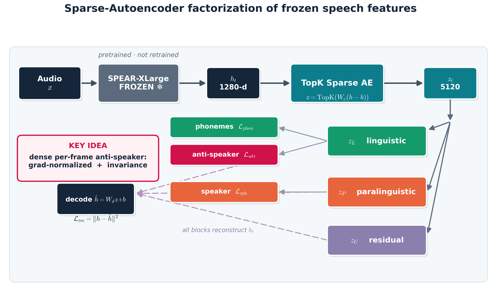
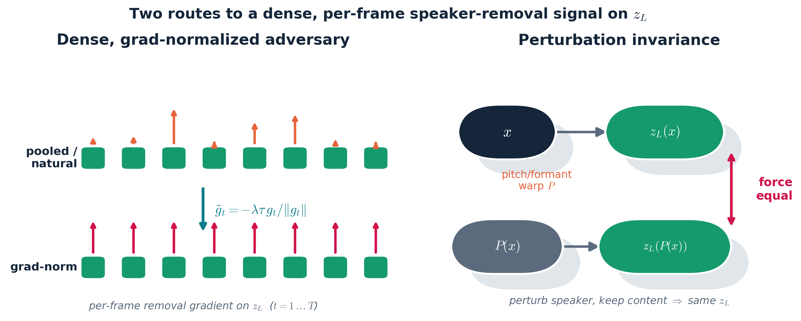
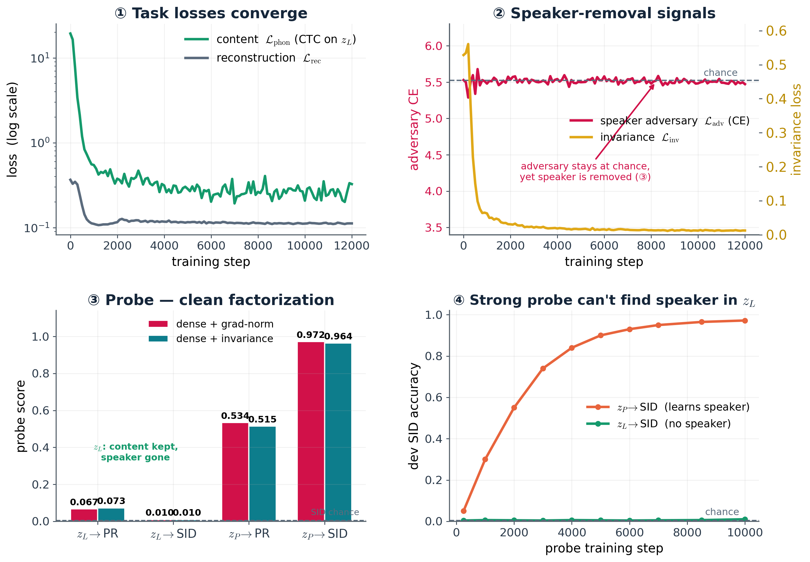

# Disentangling Linguistic & Paralinguistic Factors in **Frozen** Speech Representations with Sparse Autoencoders
### Removing speaker identity from the content code via a grad-normalized adversary + perturbation invariance — *mid-research progress*
**bbg25@cam.ac.uk · MLMI Thesis** · Encoder: SPEAR-XLarge (frozen) · Data: LibriSpeech train-clean-100

> **Layout:** 3 columns × 2 sections (6 sections). C1 = promise + method · C2 = objective + mechanism · C3 = result + outlook.

---

## ░ COLUMN 1 ░

### ① Speech-representation disentanglement → Sparse Autoencoders
Modern speech encoders pack **content** (*what* is said), **speaker** (*who*), and **prosody / emotion** (*how*) into every dimension. **Disentangling** these factors is a long-standing goal — for controllable synthesis, privacy / anonymization, and interpretability.

**Why SAEs.** Sparse autoencoders have driven recent **mechanistic-interpretability** progress — decomposing dense activations into **sparse, overcomplete, near-monosemantic** features that *surface* human-interpretable structure in large models.

**Our hypothesis.** If speech's factors live in **separable sparse directions**, an SAE can **expose and route** them — turning interpretability into **disentanglement**, *without touching the backbone*.

**This work.** Factor a *frozen* encoder's features into **linguistic** `z_L` vs **paralinguistic** `z_P`, anchored on **speaker identity (SID)** as the first paralinguistic factor — extensible to prosody, emotion, ….

### ② Method — SAE factorization

- **Frozen SPEAR-XLarge** → frame features `h_t` (1280-d), encoder **not retrained**.
- **TopK Sparse Autoencoder:** $z=\mathrm{TopK}(W_e(h-b))$, $\hat h = W_d z + b$.
- The sparse code is **factored** into `z_L` (linguistic), `z_P` (paralinguistic), `z_U` (residual).
- **Heads:** CTC phonemes on `z_L`, speaker on pooled `z_P`, reconstruction from the full code.

---

## ░ COLUMN 2 ░

### ③ Learning objective
A single multi-task loss shapes the factorization:
$$\mathcal{L}=\mathcal{L}_{\mathrm{rec}}+\alpha\,\mathcal{L}_{\mathrm{phon}}+\beta\,\mathcal{L}_{\mathrm{spk}}+\lambda_{\mathrm{adv}}\mathcal{L}_{\mathrm{adv}}+\lambda_{\mathrm{inv}}\mathcal{L}_{\mathrm{inv}}$$

- **Reconstruction** $\mathcal{L}_{\mathrm{rec}}=\frac1T\sum_t\lVert h_t-\hat h_t\rVert^2$ — all blocks together rebuild $h_t$.
- **Content** $\mathcal{L}_{\mathrm{phon}}=\mathrm{CTC}(g_\phi(z_L),y)$ — phonemes decodable from `z_L`.
- **Speaker** $\mathcal{L}_{\mathrm{spk}}=\mathrm{CE}(\mathrm{pool}(z_P),s)$ — identity captured by `z_P`.
- **Removal** $\mathcal{L}_{\mathrm{adv}},\,\mathcal{L}_{\mathrm{inv}}$ — push speaker *out of* `z_L` (next panel).

**Evaluation = strong probes** (linear / stats — the best validated reader): content = PER ↓, speaker = SID acc ↑, per block.

### ④ Removing speaker from `z_L` — a dense, per-frame signal

Speaker is an **utterance-level** label but `z_L` is **per-frame** — a pooled adversary gives just one diluted gradient. We make the speaker GRL **dense (per-frame)**: a discriminator $d_\psi$ at *every* frame, so each frame receives its own removal gradient. Two complementary routes then strengthen it:

- **Grad-normalized adversary.** L2-normalize each frame's reversed gradient to a fixed magnitude $\tau$ — every frame gets an equal push, regardless of discriminator confidence:
$$\tilde g_t=-\lambda\,\tau\,g_t/\lVert g_t\rVert,\qquad g_t=\partial\mathcal{L}_{\mathrm{adv}}/\partial z_L[t]$$
- **Perturbation invariance.** A pitch+formant warp $P$ changes the speaker but keeps content; force `z_L` invariant (a second dense signal):
$$\mathcal{L}_{\mathrm{inv}}=\tfrac1T\textstyle\sum_t\frac{\lVert z_L(x)_t-z_L(P(x))_t\rVert^2}{\frac12(\lVert z_L(x)_t\rVert^2+\lVert z_L(P(x))_t\rVert^2)}$$

---

## ░ COLUMN 3 ░

### ⑤ Result — clean factorization

**Two independent routes** reach the same clean split (real probe TEST numbers; SID chance = 0.004):

| route | `z_L` PER ↓ | `z_L`→SID ↓ | `z_P` PER ↓ | `z_P`→SID ↑ |
|---|---|---|---|---|
| **dense + grad-norm** | **0.067** | **0.010** | 0.534 | **0.972** |
| **dense + invariance** | **0.073** | **0.010** | 0.515 | **0.964** |

- `z_L` keeps content (PER ≈ raw 0.068), **speaker scrubbed to chance**; `z_P` holds speaker, sheds content.
- Grad-norm and invariance **replicate one another** → the result is method-robust, not a single lucky run.
- **Rigorous:** strong stats probe, 10k steps; positive control (`z_P`→SID ≈ 0.97) passes; `z_L` content intact (not collapsed).

### ⑥ Outlook — toward full paralinguistic factorization
- **SID is factor #1.** Next, give `z_P` more paralinguistic jobs — per-frame **prosody** (log-F0, energy), then **emotion / accent** — turning `z_P` into a multi-task paralinguistic code.
- **Strengthen evidence:** replicate across seeds + **held-out-speaker** probe.
- **Full 3-way split:** give the residual `z_U` a positive reconstruction role so content / speaker / residual cleanly separate.

*SPEAR-XLarge (frozen) · LibriSpeech train-clean-100 · SUPERB 74-phone CTC · 251-speaker SID · probes report TEST.*
