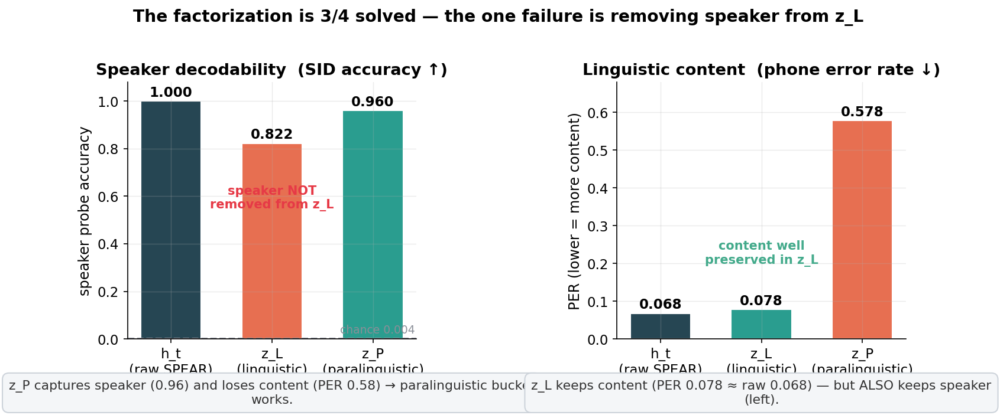
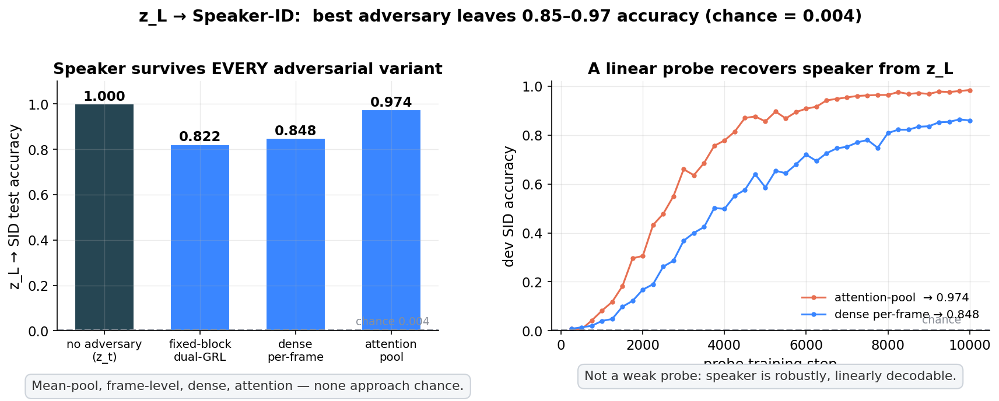
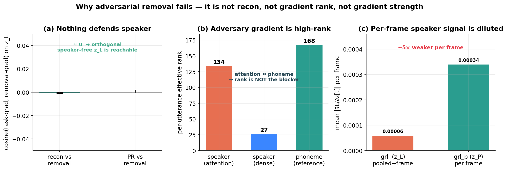
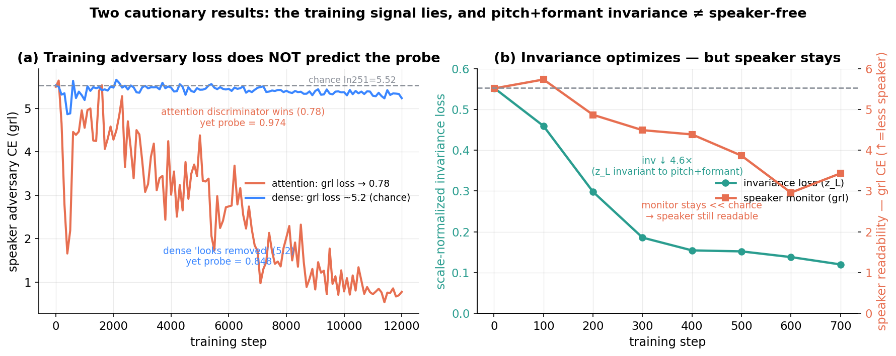

# Disentangling speaker from linguistic content in frozen SPEAR features — progress report

**Setup.** We take a **frozen SPEAR-XLarge** encoder (frame-level features `h_t`, 1280-d, ~50 Hz) and learn a **TopK Sparse Autoencoder** on top. The sparse code `z_t` (K = 5120 atoms) is carved into three fixed index blocks — `z_L` (linguistic), `z_P` (paralinguistic), `z_U` (residual) — trained with reconstruction + a CTC phoneme head on `z_L` + a speaker head on `z_P`, and adversaries that should push speaker **out of** `z_L`. Disentanglement is measured by **linear probes** (the strongest validated reader): low PER off `z_L` = content present; speaker accuracy off `z_L` should fall to chance (1/251 = 0.004).

**Headline result.** Content routing works and speaker is captured by `z_P` — but **no method we tried removes speaker from `z_L`**. Below are the experiments, the failure, the diagnostics that rule out the obvious causes, and the structural hypothesis they point to.

---

## 1. The factorization is 3/4 solved

`z_L` keeps content as well as the raw features (PER 0.078 vs 0.068) **and** keeps speaker (SID 0.82). `z_P` does the opposite — captures speaker (0.96), drops content (PER 0.58). So the buckets specialise correctly in every respect **except** scrubbing speaker from `z_L`.

## 2. Speaker survives every adversarial variant

Mean-pool, frame-level, dense per-frame (31-frame context), and attentive-statistics pooling — with an awakened, full-strength discriminator — all leave **0.82–0.97** speaker accuracy in `z_L`. The probe curves (right) show this is not a weak-probe artifact: a linear reader recovers speaker robustly.

## 3. Why it fails — the obvious causes are ruled out by measurement

- **(a)** The speaker-removal gradient is **orthogonal** to both reconstruction and PR (cos ≈ 0). Nothing "defends" speaker — a speaker-free, content-rich `z_L` is *reachable* without collateral.
- **(b)** The attention adversary's removal gradient is **high-rank (134 ≈ phoneme's 168)** and its discriminator *does* read speaker — so it is **not** a weak/low-rank/diluted-gradient problem. (The dense head is low-rank only because its per-frame discriminator is stuck at chance.)
- **(c)** Per-frame, the pooled speaker signal each frame receives is **~5× weaker** than the per-frame phoneme signal — speaker is an utterance-level label forced through a per-frame bottleneck.

## 4. Two cautionary results

- **(a)** The **training-time adversary loss does not predict the probe.** The dense run's `grl` sits at chance (looks "removed") yet probes 0.85; the attention run's discriminator wins (`grl`→0.78) yet probes 0.97. Only the held-out probe tells the truth.
- **(b)** A **scale-normalized invariance** loss (force `z_L(x) ≈ z_L(pitch+formant-perturbed x)`) genuinely optimizes (↓ 4.6×) **without** breaking content — but the speaker monitor stays far below chance: pitch+formant invariance removes a *slice* of speaker, not speaker identity.

---

## Diagnosis

Adversary and invariance fail the **same way** — they reduce speaker as read by *one* mechanism, and it survives in the complement. The diagnostics rule out reconstruction conflict, gradient rank, and gradient strength. What is left is **structural**:

> The encoder is **frozen** and the SAE is a (piecewise-linear, TopK) **re-code**. It can only **route** the information already in `h_t` into index blocks — it cannot **nonlinearly transform** the signal to *synthesize* a speaker-free content code. Since SPEAR encodes phonemes in a **speaker-dependent** geometry (speaker probes `h_t` at 1.00), any `z_L` rich enough for phonemes inherits speaker, and no removal loss has a speaker-free target to move toward.

This is **not** an intrinsic ceiling: speaker-invariant content *is* achievable, but in the literature it is produced by a **trained nonlinear encoder** (ContentVec, NANSY, SIT) — capacity our frozen+linear setup lacks.

## Proposed next step

Replace fixed-index routing with a **learned nonlinear factorizer** on `z_t` (`z_L = f_L(z_t)`, etc.), and put a **bottleneck that destroys continuous speaker** on the content factor — **vector quantization** (as in VQMIVC/ContentVec) or a **VIB**. Reconstruction through asymmetric bottlenecks then *forces* speaker into `z_P`. Invariance (now acting on a code that can actually be made invariant) and the adversary become mop-up, not the main mechanism.

**Question for discussion:** is it worth keeping the SAE as the disentangler (interpretable, but linear-routing-limited), or should the SAE become a sparse front-end with the disentangling done by a learned nonlinear factorizer + VQ bottleneck? A cheap **INLP / nullspace-projection** check on cached `h_t` (does content survive after linearly removing speaker?) would quantify how hard the bottleneck must squeeze before we build it.

---
*All numbers transcribed from training/probe logs (LibriSpeech train-clean-100, 251 speakers; PR = SUPERB 74-phone, dev/test-clean). Probe = strongest linear/stats reader, 10k steps, early-stopped on dev.*
